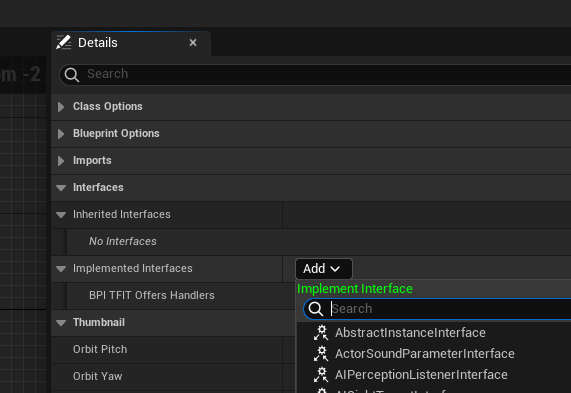
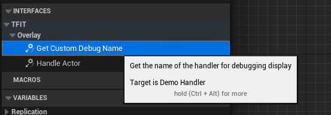
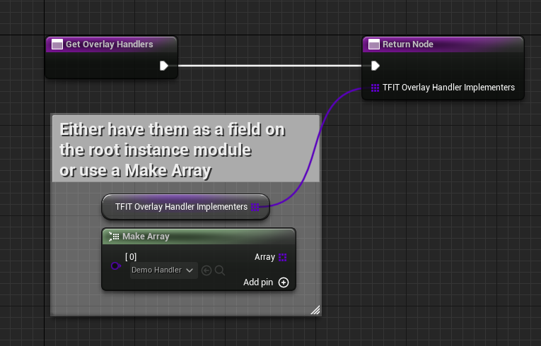
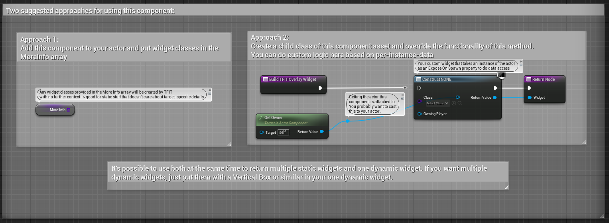
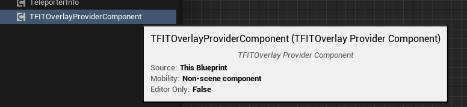
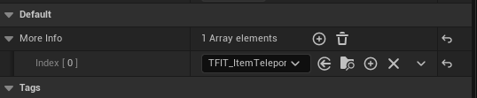
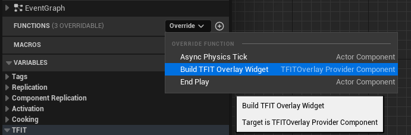

# TFIT

If you have any questions, please contact Robb#6731 on the main modding discord.

In most cases you **don't need to add TFIT as a dependency to your mod's `uplugin` file**.
However, you will need to have TFIT loaded in your editor for the interfaces and components to be available.

## TL;DR

There are multiple ways to add TFIT compatibility to your mod,
and the method you should use depends on what you're adding a info for
and how dynamic that information is.

1. Creating Handler objects or subsystems
   - Works for the Overlay or Tooltips
   - Most flexible approach
2. Adding an `TFITOverlayProviderComponent` (or a custom subclass you make) to your actor
   - Only works for the Overlay
   - Requires your mod to be the one defining the actor
<!-- 3. TODO the fancy named field reflection way Robb hasn't implemented yet -->

## Handlers Approach

If you use the handlers approach, your mod **does NOT** need to depend on TFIT for the mod to work for the player.

In order to use the Handlers approach:

1. Add the `/TFIT/Compatibility/BPI_TFIT_OffersHandlers` interface to your mod's Root Instance Module
   - (open the asset) > 'Class Settings' > 'Interfaces' header > 'Implemented Interfaces' 'Add' dropdown
   - 
2. Create a ModSubsystem or UObject somewhere in your mod's content to use as the handler
   - If you used a Subsystem, remember to add it to your Game World Module's subsystems array and set the subsystem's replication policy accordingly (ex. "Spawn on Client and Server, Never Replicate) or else client behavior will differ from servers
   - If you used a UObject, read the note at the bottom of this section.
   - You do NOT want to use anything you would expect there to be more than one of for this. So if you're adding a handler for a buildable, **don't** use your buildable here.
3. Open your handler asset in the editor
4. Add the relevant interface
   - For Tooltips: `/TFIT/Compatibility/BPI_TFIT_TooltipHandler`
   - For Overlays: `/TFIT/Compatibility/BPI_TFIT_OverlayHandler`
5. Define a name for your handler in the `Get Custom Debug Name` interface method
   - 
6. Write code in your the "Handle Inventory Stack" and "Get Desired Tooltip Section" (tooltips) or "Handle Actor" (overlays) methods to provide the information you want to display
   - For code examples, look at TFIT's own handlers (`/TFIT/Overlay/Handlers` and `/TFIT/Tooltips/Handlers`)
7. Return to your mod's Root Instance Module and add the class of your handler to be returned by the `Get Overlay Handlers` or `Get Tooltip Handlers` method respectively
   - 
8. You're done! Test it in-game.

Although any UObject can implement the compatibility interfaces TFIT offers, even plain UObjects, beware of operations that require world context (such as creating widgets or accessing subsystems). In this situation, your handler should be something with world context, such as a Mod Subsystem.

If the class you provide in your Root Instance module is a subclass of Actor,
TFIT will treat it as a singleton and get the (presumably only) existing instance of it for use.
If it's not a subclass of Actor, or the actor it found was not valid, it will fall back to using the class's default object.

In TFIT's own code, HandleCreature and HandlePickup are examples of cases where a subsystem actor was used as the handler instead of a plain UObject because world context was required.

### Extra Info on Tooltip Handlers

- TFIT offers multiple possible sections of the tooltip that your widget can be inserted to.
  Use the 'Get Desired Tooltip Section' interface method to control this.
- TFIT is capable of processing tooltips for items even without existing item state (unlike SML tooltip handlers)
  - This means that TFIT tooltips will work when hovering over item cost slots in machines, for example. SML tooltip handlers don't.
- TFIT will try to automatically handle any tooltip widgets that other mods insert, so if you already use an SML tooltip handler or add a widget to the tooltip yourself, TFIT will keep it around.
  - If you want your "regular" tooltip to be moved into a specific section, you have its widget implement the `BPI_TFIT_TooltipHandler` interface on your widget and return the section you want in the `Get Desired Tooltip Section` method.

## Actor Component System

The actor component system is available as an alternative to creating an Overlay Handler.
You should only use this approach when your mod defines the actor that you want to provide info for,
since you need to place an Actor Component on the actor.
You could add the component with hooking, but I don't see any benefits to this approach over the Overlay Handler
if you have to go that far.

This approach also comes at the performance cost of an additional actor component on each instance of the actor,
so consider using the Overlay Handler approach instead.

See the screenshot taken from `/TFIT/Compatibility/TFITOverlayProviderComponent` for details on the two approaches.

### Using Approach 1

You'll need to create a new widget class for use in the overlay.

After creating your widget,
use the "Add Component" button in the actor editor to add a `TFITOverlayProviderComponent` to your actor.
Add your widget to the "More Info" array by selecting the component in the actor tree and editing its defaults.

If you need to know what instance of your actor you are looking at from this widget,
you should use Approach 2 instead.
However, if you still want to use Approach 1 for some reason, you can [do this](Images/TFIT_Subsystem.png) to pickpocket the TFIT systems and access it.

### Using Approach 2

To create a child class of `TFITOverlayProviderComponent`, use the normal Create Basic Asset > Blueprint Class menu, then specify `TFITOverlayProviderComponent` as the parent class.

Add your component to your actor the same way you did in Approach 1.

Instead of using the "More Info" array, you can now override the "Build TFITOverlay Widget" method to create a widget for returning and perform your custom logic.
There is no need to call the parent function - the parent has a no-op stub.

As demonstrated in the screenshot of Approach 2 in the [section above](/#Actor_Component_System),
you can use the Actor Component method "Get Owner" to get the specific instance of your actor
for use in your widget.

## Blueprint and C++ Libaries

TFIT offers a few useful functions, such as:

- Look up ownership of content that isn't in the Mod Content registry, or content that has innaccurate Mod Content Registry entries.
- Obtain foliage drop data from an instanced actor or a static mesh component
- Suggest an AWESOME Sink points value for a recipe's products based on its ingredients, even if the ingredients are fluids

If you use these, you will need to list TFIT as a dependency in your mod's `uplugin` file.

## FAQ

If you have any other questions, please contact Robb#6731 on the main modding discord.

### Does my mod need to depend on TFIT?

Your main mod doesn't need to depend on TFIT.

### What happens if the user uninstalls TFIT, will my main mod stop working?

No, See above question.
