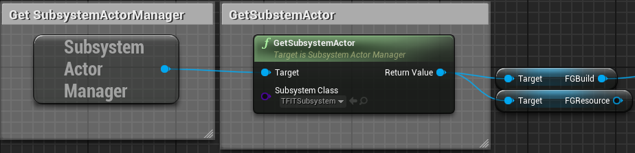

# TFIT

# How to use
 1. Go into your Mod and inside your Buildables Add TFITDescription Component  
 2. Create a User Widget contains any additional information you want to display for your building
 3. add your widget to the array in TFITDescription Component
 4. Done! go Update your mod 

### Access the hit Buildable
You can access the hit Buildable from TFIT Substyem shown in the image below 

# FAQ

### Does my mod need to depend on TFIT?
Your main mod doesn't need to depend on TFIT

### What happend if the user uninstalls TFIT, will my main mod stop working?
No, See above question.
 
